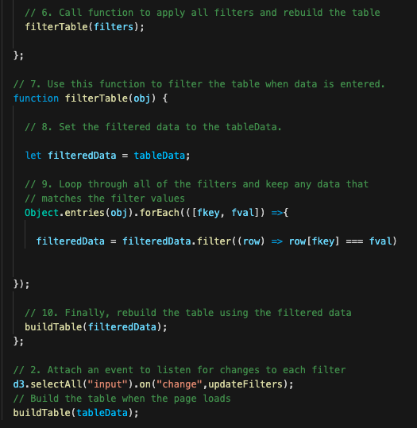

# UFOs

## Overview of Project
The purpose of this project is to build a dynamic webpage to showcase a UFOs information table along with intersting article. We build our dynamic pages accept user inputs and visually adjust to reflect that interaction by inserting Javascript into an HTML page. We start by building a table to hold and neatly display the data we want to work with. Then, we add filters of that table which lets users refine their search on more than one level. We use basic HTML, Bootstrap and CSS to build and style the entire page. We also include an attention grabbing header, article summary, and brief article. Our end result is a presentation of data that is both visually appealing and interactive. 

## Results

In this section, we are going to demostrate how to use our webpage to filter the UFOs table base on the following criterias: Date, City, State, Country and Shape. First, please clike the the following link to go to our website: https://yycheung.github.io/

* First, when a user enters search criteria, the JavaScript code we write will store the value in the text box and IDs associated with the text box in a JavaScript Object. For example, when a user type in "1/10/2010" for the search criteria Date, the UFOs table will be filtered simultaneously by just showing data of the date 1/10/2010. 

* If a user enter multiple search criterias, such as the Date "1/10/2010" and a Country "US", and Shape "circle", these filters will be storeed in a list to filter the results. And same as ablow, the UFOs table will be filtered simultaneously by just showing data in US, the UFO shape is circle and on the date 1/10/2010.

Now, let's look into our HTML code to see how it works at the back end. Our HTML code creates the serach parameters. They are organized as list elements. 

For each element, there's a lable for that element contains the lable for each search parameter. There's an input element that provides the input box. Each input element has an "id" and a placeholder. The id is the property for each element in the data set (date, city, state, county and shape). Then, we will have a script to store all the values and ids that have changed. 

In our app.js file, we have a function called updateFilters() which is used to update the filters object and store the search criterias entered by the user in a list. Before that, we have created a variable to keep track of all the filters as an object. 

First, we have a variable that seclects all the elements changed. This code initialize an array to store the value and id. 

 Then, we create a variable that holds the value of the perperty that has changed. 

After that, we create a variable that holds the id of the id arribute that has changed.

Next, using an if else statment. we need to check if a value was entered and sotred in the elements value variable. If a value was entered, then we need to add it and the filter id to the filters object. If a value was not added, then will clear the filter id from the filter onject.Finally, we will call the update table functio which loops through the filters object and for each key and value that is stored, our function will filter the UFOs table as indicated by the search parameters. 

Now, we can use our updateTable function to update the UFOs table based on search criterias. Below the updateTable function, we write a code for event listener. This code detects which input elements have changed on the HTML page, and when they change, it calls the function updateTilter().

## Summar
Our webpage and dynamic table are working well, and it provides an in-depth analysis of UFO sightings by allowing users to filter for multiple criteria at the same time. However, we need a place to publicly display the information. Thus, we used GitHub Pages, a website presentation to showcase our work. Here is the link: https://yycheung.github.io/UFOs/. 

Secondly, the current search can only filter the data by showing a specific date, it would be fantastic if we can show the results in a period. We can achieve it by adding "in between date" filter.

